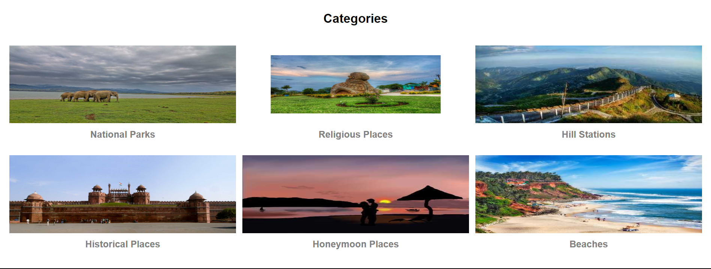
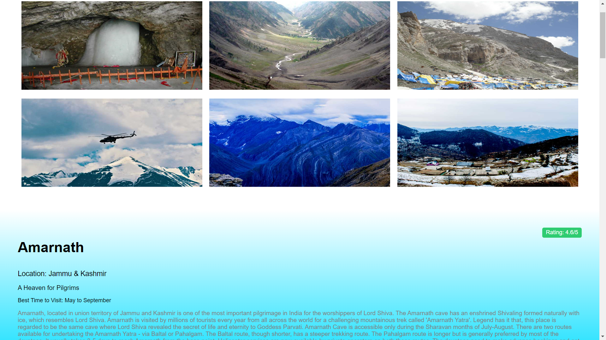

	
	<h1>Trawell</h1>
	<h2>Microsoft Future Ready Talent Project</h2>
	<h4>Trawell is a website that allows users to explore different tourist places in India. It provides information about famous tourist destinations, including their names, locations, descriptions, images, ratings, and the best time to visit each place.</h4>
	<a href="https://tra-well.azurewebsites.net">Live link</a>

## Web View

## Features

- Categorized Places: Explore various tourist places in India, organized into different categories.
- Detailed Information: Each place provides comprehensive details such as name, location, description, rating, and the best time to visit.
- Get an idea about the beauty of the place with beautiful images provided for each destination.
- Interactive Interface: Enjoy a user-friendly interface that enhances the browsing experience.

## Azure Cloud Platform

Azure is a cloud computing platform and service provided by Microsoft. It offers a wide range of cloud-based services and solutions that help developers and businesses build, deploy, and manage applications and services with ease. Azure provides a scalable, reliable, and secure infrastructure for hosting and running applications, allowing seamless integration with various services and tools.

## Azure Services Used in our project

Trawell utilizes the following Azure services:

### Azure App Service

Azure App Service is a fully managed platform-as-a-service (PaaS) offering provided by Azure. It is used in Trawell for deploying and hosting the backend of the website. Azure App Service simplifies the process of deploying web applications, providing scalability, automatic OS patching, and seamless integration with other Azure services. With App Service, you can focus on developing your application without worrying about the underlying infrastructure.

### Azure Blob Storage

Azure Blob Storage is a scalable and secure cloud storage service provided by Azure. It is used in Trawell for storing and serving images of tourist places. Blob Storage provides reliable storage and high-performance access to images, allowing efficient retrieval and delivery to users. With Blob Storage, you can easily manage and distribute image assets to enhance the visual experience of your application.

### Azure Cosmos DB

Azure Cosmos DB is a globally distributed, multi-model database service provided by Azure. In Trawell, Azure Cosmos DB is used as a MongoDB-based database service for storing and retrieving place information. Cosmos DB offers low-latency, scalable, and highly available data storage with support for various data models and APIs. It provides seamless global distribution, automatic indexing, and comprehensive SLAs for guaranteed performance and availability.

## Installation

To run the Trawell website locally, follow these steps:

1. Install Python & Git on System
2. `git clone https://github.com/ansh-333k/FRT_Project.git`
3. Open the parent folder of `app.py` (i.e., FRT_Project) file in the Linux Terminal
4. `pip install virtualenv` (To Install Python Virtual Environment Library)
5. `virtualenv venv` (To Create Virtual Environment)
6. `source ./venv/bin/activate` (To Activate Virtual Environment)
7. `pip install -r requirements.txt` (To Install All the Required Python Libraries in One Go)
8. `python app.py` (To Run Application)
9. Access the running website from any browser at: `https://127.0.0.1/5000`
10. Additional Information
    - `Ctrl + C` (To Stop the Running Application)
    - `deactivate` (To Shut Down the Virtual Environment)

## Usage

Once the website is running, you can:

- Browse different categories of tourist places.
- Click on a place to view its detailed information, including name, location, description, images, rating, and best time to visit.

## Contributing

Contributions to Trawell are welcome! If you would like to contribute to the project, please follow these steps:

1. Fork the repository.
2. Create a new branch: `git checkout -b my-feature-branch`
3. Make your changes and commit them: `git commit -m 'Add some feature'`
4. Push your changes to the branch: `git push origin my-feature-branch`
5. Submit a pull request detailing your changes and their benefits.

## Contributors

We would like to acknowledge the following individuals for their contributions to the Trawell project:

- [Ansh Kushwaha](https://github.com/ansh-333k/)
- [Ashish Kumar](https://github.com/AshkumCurious)
- [Kundan Kumar](https://github.com/Kd1129)
- [Prakash Bist](https://github.com/prakashbist28)

Thank you for your valuable contributions!

##

